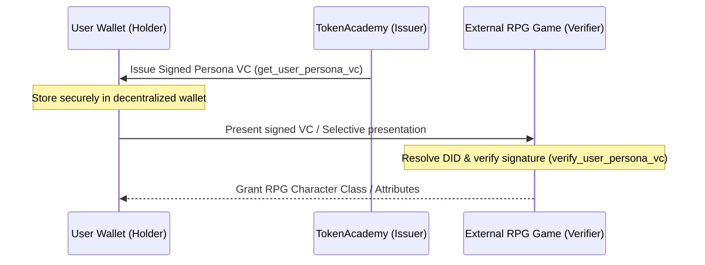

# Walkthrough: Persona Data Exchange Standardization (W3C VC & JSON-LD Integration)

This walkthrough documents the design architecture, standards alignment, and code-level configurations for packaging the 5-dimensional Persona profile into standard-compliant **W3C Verifiable Credentials (VC)** with a semantic **JSON-LD Context Schema**.

---

## 1. Verifiable Persona Credentials Architecture

To allow secure, decentralized, and privacy-preserving data exchange, we package the multi-dimensional user profile inside a cryptographically signed W3C Verifiable Credential envelope.



---

## 2. JSON-LD Context Vocabulary Schema

We defined a standard JSON-LD schema context under `@persona/core` representing the 5 core dimensions (`competence`, `health`, `psycho`, `behavior`, `social`).

### `persona-context.jsonld` (Schema Context)
```json
{
  "@context": {
    "@version": 1.1,
    "@protected": true,
    "id": "@id",
    "type": "@type",
    "PersonaCredential": {
      "@id": "https://lingjing-persona.org/schema/persona/v1#PersonaCredential",
      "@context": {
        "persona": {
          "@id": "https://lingjing-persona.org/schema/persona/v1#persona",
          "@context": {
            "competence": {
              "@id": "https://lingjing-persona.org/schema/persona/v1#competence",
              "@context": {
                "logicalReasoning": "https://lingjing-persona.org/schema/persona/v1#logicalReasoning",
                "proceduralToolMastery": "https://lingjing-persona.org/schema/persona/v1#proceduralToolMastery"
              }
            },
            "health": {
              "@id": "https://lingjing-persona.org/schema/persona/v1#health",
              "@context": {
                "fatigueIndex": "https://lingjing-persona.org/schema/persona/v1#fatigueIndex",
                "sleepQualityObservation": "https://lingjing-persona.org/schema/persona/v1#sleepQualityObservation"
              }
            }
            // Additional dimensions (psycho, behavior, social) mapped to semantic IRIs...
          }
        }
      }
    }
  }
}
```

---

## 3. Cryptographic Signature & Verification

The builder and verifier handle W3C compliance and Elliptic Curve (P-256) signature verification:
* **Signing Suite**: Supports standard `JsonWebSignature2020` proofs containing signatures generated via EC (P-256) private keys in JWK format.
* **Selective Disclosure**: Supports filtering out specific sensitive dimensions (e.g. keeping health data hidden) when packaging the credential.
* **Mock Key Fallback**: Allows a dry-run mock mode (JWS value as `mock-signature-payload`) to ease integration tests and local development.

---

## 4. MCP Server VC Integration

The pluggable `@persona/mcp` server exposes two new tools to standard client frameworks:

### 1. `get_user_persona_vc`
* **Purpose**: Compiles a signed Verifiable Credential envelope for the user.
* **Response**: Signed W3C Verifiable Credential JSON.

### 2. `verify_user_persona_vc`
* **Purpose**: Validates the authenticity and expiration of a shared VC.
* **Response**: Verification status (`verified: boolean`) and claims metadata.

---

## 5. Web App & Gateway Integration

We integrated the Verifiable Credential export logic back into the Next.js `web-app`:

### 5.1 Export API Route (`app/api/persona/export/route.ts`)
We created a new API endpoint at [route.ts](file:///c:/Users/xiaop/Code/py/lingjing/tokenacademy-school/web-app/app/api/persona/export/route.ts) that handles:
* Enforcing user authentication and reading user profile details from `personaDomainRecords` table.
* Merging multidimensional entries into a unified profile.
* Packaging and signing the profile as a standard W3C Verifiable Credential using `@persona/core`.
* Serving it as a downloadable JSON file with the appropriate `application/ld+json` MIME type headers.

### 5.2 UI Download Integration (`standard-reports-workbench.tsx`)
We modified the dashboard report component at [standard-reports-workbench.tsx](file:///c:/Users/xiaop/Code/py/lingjing/tokenacademy-school/web-app/features/persona/reports/standard-reports-workbench.tsx#L349-L365) to render a **"Download VC"** button next to the standard timeline button, allowing users to interactively download their portable JSON-LD credentials.

---

## 6. Verification Results & Testing

1. **Vitest Execution**: Created [vc-standardization.test.ts](file:///c:/Users/xiaop/Code/py/lingjing/tokenacademy-school/packages/persona-core/tests/vc-standardization.test.ts) covering standard packaging, EC P-256 signature generation/verification, selective disclosure, and expiration.
   * Result: **5 passed, 0 failed** (18ms execution time).
2. **Compilation**: Both `@persona/core` and `@persona/mcp` build and compile successfully using `tsc`.
3. **Typechecking**: Next.js `web-app` typechecking (`npx tsc --noEmit`) passes with **zero errors**.

---

## 7. Automated Schema Regeneration & GitHub Pages Staging

We integrated a build script to generate the GitHub Pages static website files automatically upon compiling the `@persona/core` package:

### 7.1 Compilation Process Integration
The `build` script in [package.json](file:///c:/Users/xiaop/Code/py/lingjing/tokenacademy-school/packages/persona-core/package.json) was updated:
```json
"scripts": {
  "build": "tsc && node scripts/generate-dist-schema.js"
}
```

### 7.2 Staging Directory Structure
Running `npm run build` within `@persona/core` regenerates the files in [persona-dist-schema/](file:///c:/Users/xiaop/Code/py/lingjing/persona-dist-schema):
* **`CNAME`**: Contains the target custom domain `lingjing-persona.org`.
* **`.nojekyll`**: Disables Jekyll parser processing to allow serving raw `.jsonld` files.
* **`schema/persona/v1.jsonld`**: Automatically copied from the package's JSON-LD context schema.
* **`README.md`**: Hosts instructions on deploying the schema to the GitHub Pages repository.

---

## 8. W3C Verifiable Presentation (VP) Support (Option B)

We implemented Verifiable Presentation (VP) packaging and validation logic in `@persona/core` and exposed it in `@persona/mcp`:

### 8.1 Core Modules
* **Builder**: [vp-envelope-builder.ts](file:///c:/Users/xiaop/Code/py/lingjing/tokenacademy-school/packages/persona-core/src/vc/vp-envelope-builder.ts) packages one or more Verifiable Credentials (VCs) into a W3C-compliant `VerifiablePresentation` signed by the Holder. It cryptographically binds a `challenge` and `domain` parameter to prevent replay attacks.
* **Verifier**: [vp-verifier.ts](file:///c:/Users/xiaop/Code/py/lingjing/tokenacademy-school/packages/persona-core/src/vc/vp-verifier.ts) validates the holder's signature on the VP, verifies the challenge and domain matching expectations, and recursively verifies each nested VC (checking expiration and issuer signatures).

### 8.2 MCP Tools
Two new tools are exposed to client workflows in [mcp-server.ts](file:///c:/Users/xiaop/Code/py/lingjing/tokenacademy-school/packages/persona-mcp/src/mcp-server.ts):
1. **`get_user_persona_vp`**: Packages VC(s) with standard holder DID, challenge, domain, and an optional private key to build a signed VP.
2. **`verify_user_persona_vp`**: Verifies a shared VP against the expected challenge and domain, performing full signature validation on the presentation and the nested credentials.

### 8.3 Verification Results
1. **VP Vitest Suite**: Created [vp-standardization.test.ts](file:///c:/Users/xiaop/Code/py/lingjing/tokenacademy-school/packages/persona-core/tests/vp-standardization.test.ts) covering mock and cryptographic signatures, challenge/domain checks, nested VC expiration, and invalid issuer signatures.
   * Result: **6 passed, 0 failed**.
2. **Typecheck & Build**: Both `@persona/core` and `@persona/mcp` build cleanly. The Next.js `web-app` typechecking passes with **zero errors**.


