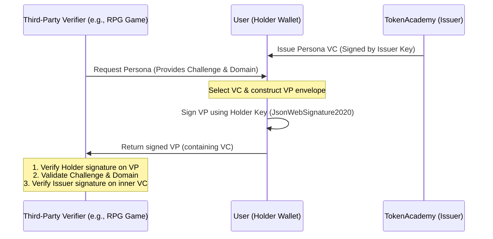

# Implementation Plan: W3C Verifiable Presentation (VP) Support

This plan describes the design and implementation of W3C Verifiable Presentations (VP) for the Persona system. A VP packages one or more Verifiable Credentials (VCs) and is signed by the Holder (the user) using their private key. It includes a `challenge` and a `domain` to ensure replay protection when presenting credentials to a third-party Verifier (e.g., an RPG game, employer, or school).

---

## Architecture & Replay Protection

When a third-party verifier requests a user's persona data:
1. The verifier issues a request containing a random `challenge` (nonce) and the verifier's `domain`.
2. The user (holder) selects their Persona VC(s).
3. The user packages the VC(s) inside a Verifiable Presentation envelope, signs it with their private key, and includes the `challenge` and `domain`.
4. The verifier receives the VP, checks the holder's signature, and ensures the `challenge` and `domain` match the request, eliminating standard intercept-and-replay attacks.



---

## User Review Required

> [!IMPORTANT]
> **Signature Suites**: We will use `JsonWebSignature2020` for VP proofs, matching the standard used for VCs. The holder DID scheme will follow `did:key:<public_key_or_actor_id>` or `did:web:lingjing-persona.org`.
>
> **Mock Signature Option**: Similar to our VC implementation, a mock signature (`mock-holder-signature-payload`) will be supported when no private key is provided to facilitate development and testing.

---

## Open Questions

> [!NOTE]
> No immediate open questions have been identified, as the design aligns strictly with the W3C Verifiable Credentials Data Model v1.1 specification.

---

## Proposed Changes

### 1. Persona Core Package (`packages/persona-core`)

#### [NEW] [vp-envelope-builder.ts](file:///c:/Users/xiaop/Code/py/lingjing/tokenacademy-school/packages/persona-core/src/vc/vp-envelope-builder.ts)
* Define the `VerifiablePresentation` typescript interface.
* Implement the `buildVerifiablePresentation` function accepting:
  - `verifiableCredentials`: Array of VCs to present.
  - `options`: `{ holderDid: string; challenge: string; domain: string }`.
  - `holderPrivateKeyPemOrJwk`: Key to sign the presentation.

#### [NEW] [vp-verifier.ts](file:///c:/Users/xiaop/Code/py/lingjing/tokenacademy-school/packages/persona-core/src/vc/vp-verifier.ts)
* Implement `verifyVerifiablePresentation` function accepting:
  - `vp`: The Verifiable Presentation to verify.
  - `options`: Expected `{ challenge: string; domain: string }`.
  - `holderPublicKeyPemOrJwk`: Key to verify the presentation signature.
  - `issuerPublicKeyPemOrJwk` (optional): Key to verify the inner VCs' signatures.
* Ensure validation fails if:
  - Holder signature is incorrect.
  - Challenge or Domain mismatch.
  - Any of the inner VCs fail their respective verification checks.

#### [MODIFY] [index.ts](file:///c:/Users/xiaop/Code/py/lingjing/tokenacademy-school/packages/persona-core/src/index.ts)
* Export new VP builder, verifier, types, and utility schemas.

#### [NEW] [vp-standardization.test.ts](file:///c:/Users/xiaop/Code/py/lingjing/tokenacademy-school/packages/persona-core/tests/vp-standardization.test.ts)
* Implement automated Vitest test cases testing:
  - Standard VP packaging.
  - Cryptographic verification of holder signature.
  - Challenge/domain mismatch detection.
  - Success path with valid nested VCs.
  - Failure path with invalid or expired nested VCs.

---

### 2. Persona MCP Server (`packages/persona-mcp`)

#### [MODIFY] [mcp-server.ts](file:///c:/Users/xiaop/Code/py/lingjing/tokenacademy-school/packages/persona-mcp/src/mcp-server.ts)
* Add `get_user_persona_vp` tool:
  - Request parameters: `verifiableCredentials`, `holderDid`, `challenge`, `domain`, `holderPrivateKeyJwk`.
* Add `verify_user_persona_vp` tool:
  - Request parameters: `verifiablePresentation`, `challenge`, `domain`, `holderPublicKeyJwk`, `issuerPublicKeyJwk`.

---

## Verification Plan

### Automated Tests
* Run the new VP test suite:
  ```bash
  npx vitest run --config web-app/vitest.config.ts packages/persona-core/tests/vp-standardization.test.ts
  ```
* Run all unit tests to prevent regressions:
  ```bash
  npx vitest run --config web-app/vitest.config.ts
  ```
* Verify TypeScript compile checks:
  ```bash
  npm run build --prefix packages/persona-core
  ```
